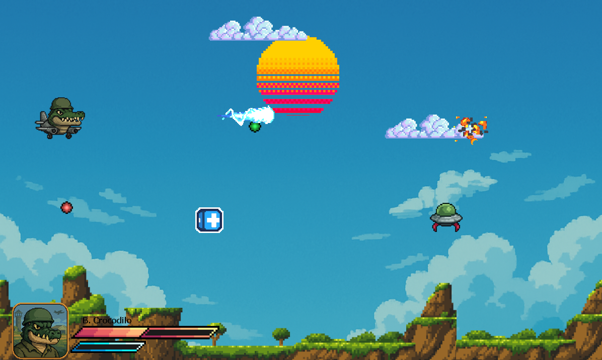
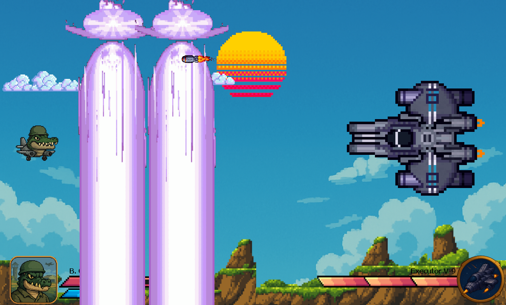

# Crocodilo Invaders 🐊

**Bombardiro Crocodilo Invaders** é um jogo arcade 2D em estilo pixel art onde você controla o bravo **B. Crocodilo**, um piloto crocodilo em combate aéreo contra invasores alienígenas. Com belos gráficos retro e uma jogabilidade intensa, o jogo oferece uma experiência cheia de ação, estratégia e efeitos visuais e sonoros marcantes.

---

##  Destaques do Jogo

-  **Pixel Art Colorido e Vibrante**  
  Cenários retrô e personagens únicos, com destaque para o pôr do sol estilizado e naves inimigas animadas.

-  **Sistema de Animações de Morte Dinâmicas**  
  Inimigos explodem com animações diferentes dependendo do tipo de projétil (básico ou especial).

-  **Trilha Sonora e Efeitos Sonoros Interativos**  
  Sons distintos para eventos como:
  - Acertar inimigos
  - Ativar o ataque especial
  - Pegar power-ups
  - Sofrer dano
  - Morrer ou vencer (em processo de melhoria)
  
-  **Sistema de Vida e Interface de HUD**  
  Barra de vida e barra de ataque especial atualizadas visualmente com sprites diferentes conforme a energia disponível.

-  **Ataques Especiais Carregáveis**  
  Ao carregar a barra especial, o jogador pode disparar projéteis mais poderosos com efeitos visuais e sonoros únicos.

-  **Sistema de Ressurgimento Inteligente dos Inimigos**  
  Inimigos reaparecem em locais aleatórios com animações *idle*, tornando a dinâmica de jogo sempre imprevisível.

-  **Sistema de Colisão Preciso**  
  As colisões entre projéteis, inimigos e o jogador são calculadas com precisão, garantindo uma jogabilidade justa e desafiante.

---
 Futuras Melhorias (Planejadas)
Melhoria dos sistemas existentes e otimização de código

Novos tipos de inimigos e chefes

Port para Unity e posteriormente postar na play store talvez.

Diferentes fases

---

## Controles

- **Setas direcionais** — Movimentam o personagem
- **Barra de espaço** — Dispara o projétil básico
- **Tecla C** — Dispara o ataque especial (quando a barra estiver cheia)
- **Power-Ups** — Pegue encostando neles para ganhar buffs especiais (vida, ataque especial ou velocidade de ataque)

---

## Tecnologias Utilizadas

- **Portugol Studio**
- Lógica baseada em arrays, timers, sprites e colisão 2D
- Sistema de áudio integrado via chamadas a biblioteca sons integrada no Portugol

---

## Como Jogar

1. Baixe os arquivos e extraia em uma pasta
2. Execute o "Brainrot Game.por" e clique no símbolo de play dentro do Portugol
   
